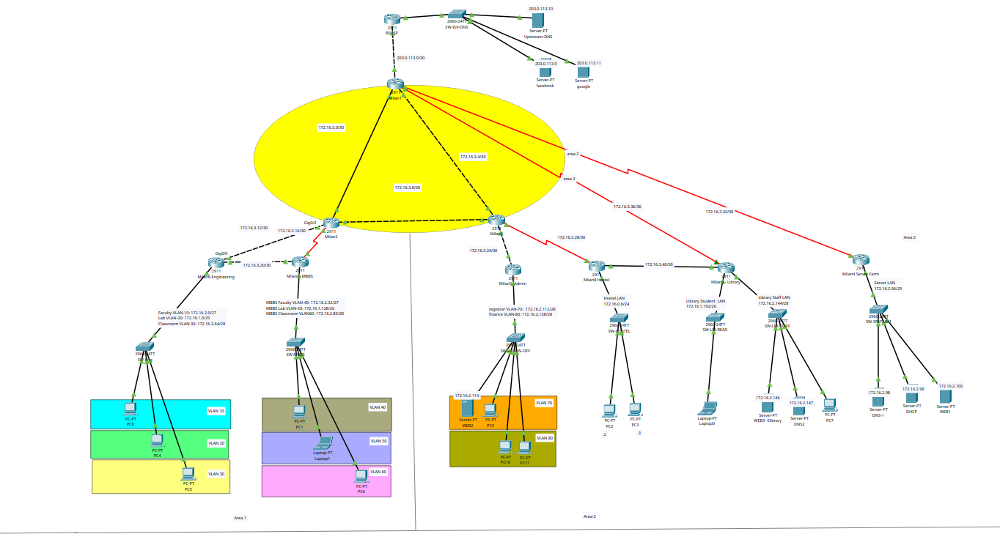

# Everest University Campus Network Design

Cisco Packet Tracer project: a 5-building campus network with multi-area OSPF, VLAN segmentation, centralized DHCP, and redundant DNS/Web services.

**Author:** Milan Gyawali (079BCT046)

## Topology

## Overview

| | |
|---|---|
| Buildings | Engineering, MBBS, Admin (NOC + Server Farm), Hostel, Library |
| Routers | 9 internal (Milan1–Milan9) + 1 ISP edge |
| Switches | 8 |
| Address block | `172.16.0.0/22` (1024 addresses) |
| Subnets | 12 LANs across 6 sizes (`/24`–`/29`) |
| Routing | OSPFv2, 3 areas |
| Redundancy | 2 backup links (Engineering↔MBBS, Hostel↔Library) + dual ABRs into Area 2 |

## Architecture

- **Area 0 (backbone):** R1, R2, R3 — co-located in the Admin building NOC, transit-only.
- **Area 1 (academic):** R2 (ABR) → R6 (Engineering), R7 (MBBS).
- **Area 2 (support/residential):** R1 + R3 (dual ABRs) → R4 (Server Farm), R5 (Admin Offices), R8 (Hostel), R9 (Library).

## Services

| Service | Host | IP |
|---|---|---|
| DHCP (central) | Server Farm | `172.16.2.99` |
| DNS-1 (primary) | Server Farm | `172.16.2.98` |
| DNS2 (redundant) | Library | `172.16.2.147` |
| WEB1 (portal) | Server Farm | `172.16.2.100` |
| WEB2 (admin) | Admin Offices | `172.16.2.114` |
| WEB3 (e-library) | Library | `172.16.2.146` |
| Upstream DNS | ISP | `203.0.113.10` |

## Internet Edge

Single static default route on R1 → ISP, redistributed campus-wide via `default-information originate`. ISP holds one aggregate static route back (`172.16.0.0/22`). No dynamic routing across the WAN link — minimum possible route entries on both sides.

## Device Access

| | |
|---|---|
| Console password | `cisco` |
| Privileged mode | `class` |
| Telnet (vty) | `network` |

## Opening the Project

Requires [Cisco Packet Tracer](https://www.netacad.com/courses/packet-tracer) 8.x or later. Open `network-design.pkt` directly.
